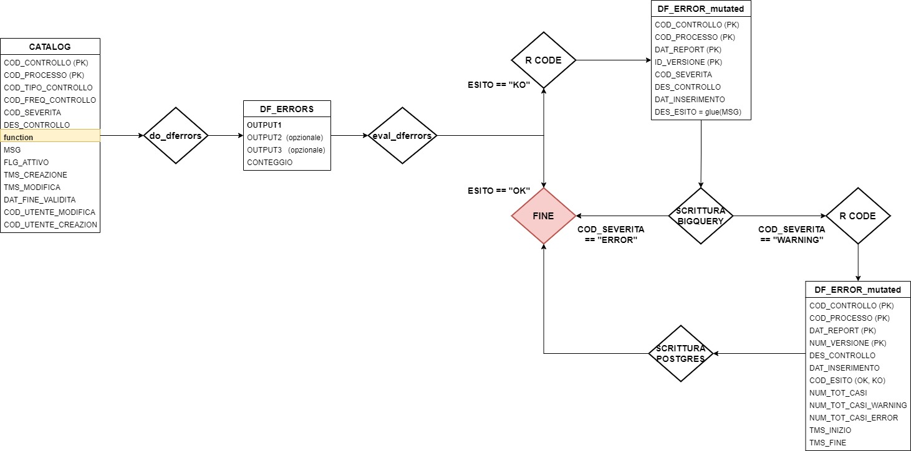

```{r, include = FALSE}
knitr::opts_chunk$set(
  collapse = TRUE,
  comment = "#>"
)
```

```{r setup}
library(ecap11cross)
```

# Struttura

```{r pressure, echo=FALSE, fig.cap="A caption", out.width = '100%'}

```